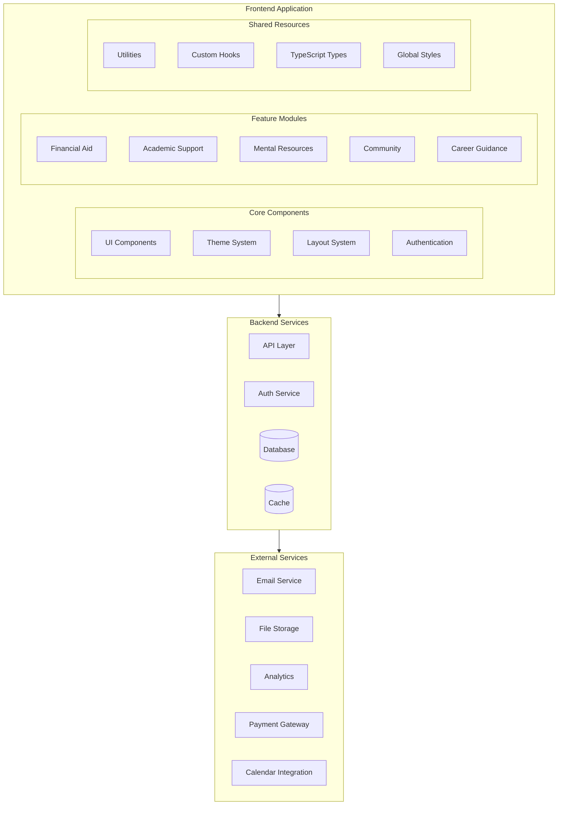
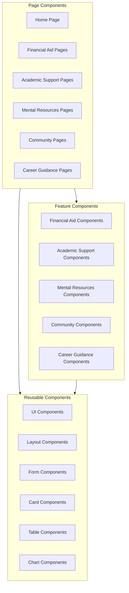
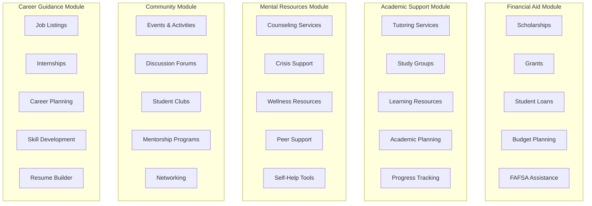
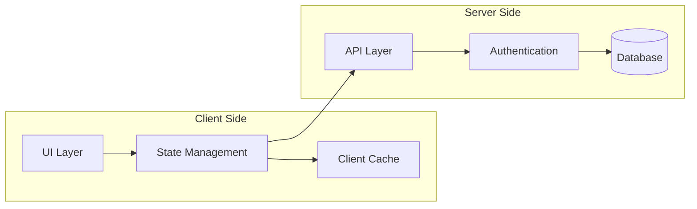
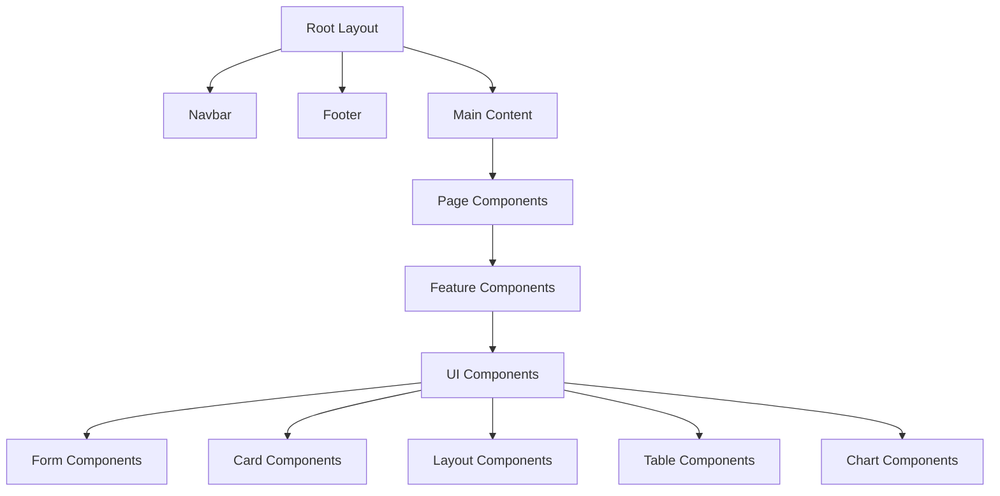
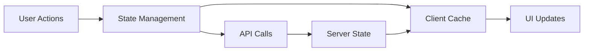
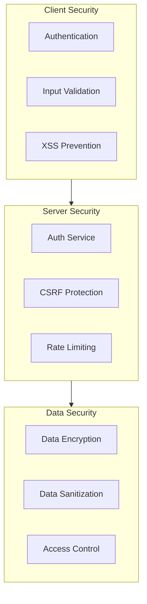
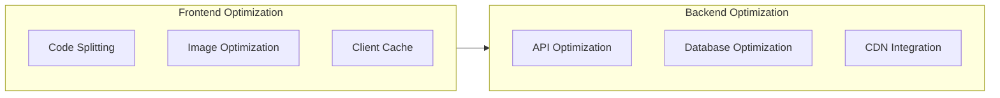
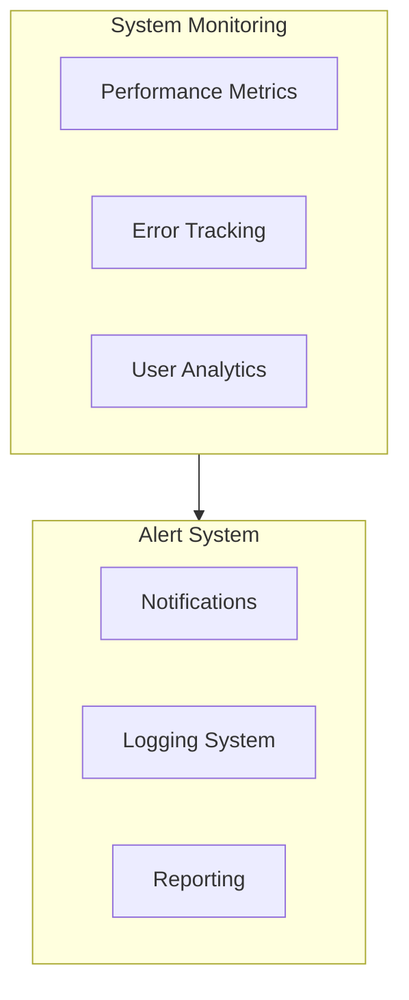

# High-Level Design (HLD) Diagram - The Student Voice

## System Architecture Overview



## Component Architecture



## Module-Specific Architecture



## Data Flow Architecture



## Technical Stack

### Frontend
- **Framework**: Next.js 14
- **Language**: TypeScript
- **Styling**: Tailwind CSS
- **UI Components**: Shadcn/ui
- **State Management**: React Context + Custom Hooks
- **Animations**: Framer Motion
- **Forms**: React Hook Form
- **Validation**: Zod
- **Icons**: Lucide React
- **Charts**: Recharts
- **Tables**: TanStack Table
- **Calendar**: FullCalendar

### Backend
- **API**: Next.js API Routes
- **Database**: PostgreSQL
- **ORM**: Prisma
- **Authentication**: NextAuth.js
- **File Storage**: AWS S3
- **Email Service**: SendGrid
- **Analytics**: Google Analytics
- **Payment Processing**: Stripe
- **Calendar Integration**: Google Calendar API

### Development Tools
- **Version Control**: Git
- **Package Manager**: npm
- **Code Quality**: ESLint + Prettier
- **Testing**: Jest + React Testing Library
- **CI/CD**: GitHub Actions
- **Deployment**: Vercel

## Key Features and Considerations

### 1. Financial Aid Module
- Scholarship and grant management
- Student loan information and applications
- Budget planning tools
- FAFSA assistance and guidance
- Financial literacy resources
- Payment processing integration

### 2. Academic Support Module
- Tutoring service scheduling
- Study group management
- Learning resource library
- Academic planning tools
- Progress tracking and analytics
- Calendar integration

### 3. Mental Resources Module
- Counseling service booking
- Crisis support resources
- Wellness tracking
- Peer support forums
- Self-help tools and guides
- Emergency contact management

### 4. Community Module
- Event management and registration
- Discussion forums and chat
- Student club management
- Mentorship program matching
- Networking features
- Community guidelines

### 5. Career Guidance Module
- Job and internship listings
- Career assessment tools
- Skill development tracking
- Resume builder
- Interview preparation
- Professional networking

## Directory Structure

```
├── app/                    # Next.js 14 app directory
│   ├── (auth)/            # Authentication routes
│   ├── (dashboard)/       # Protected dashboard routes
│   ├── financial-aid/     # Financial aid module
│   ├── academic/         # Academic support module
│   ├── mental-health/    # Mental resources module
│   ├── community/        # Community module
│   ├── career/          # Career guidance module
│   └── api/             # API routes
├── components/           # Reusable components
│   ├── ui/              # UI components
│   ├── financial-aid/   # Financial aid components
│   ├── academic/       # Academic support components
│   ├── mental-health/  # Mental resources components
│   ├── community/      # Community components
│   └── career/         # Career guidance components
├── lib/                 # Utilities and helpers
├── hooks/              # Custom React hooks
├── types/              # TypeScript types
├── styles/             # Global styles
├── public/             # Static assets
└── tests/              # Test files
```

## Component Hierarchy



## State Management Flow



## Security Architecture



## Performance Optimization



## Monitoring and Analytics

