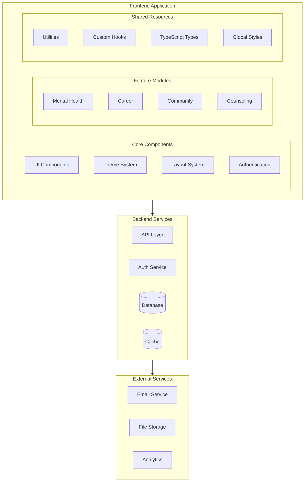
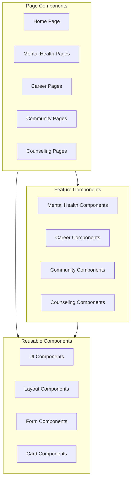
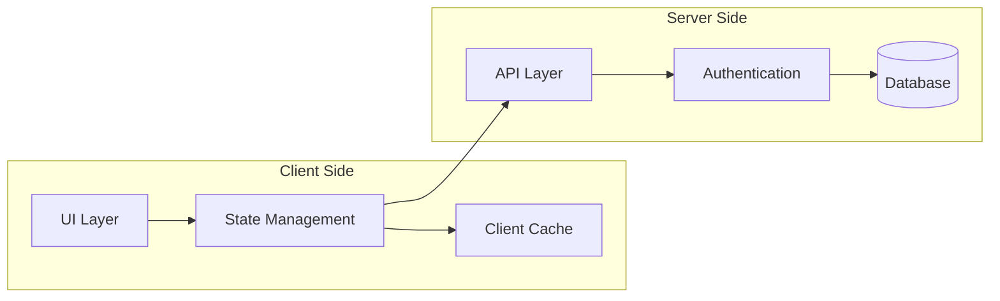
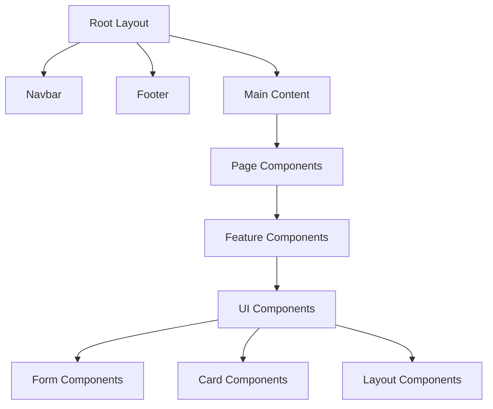
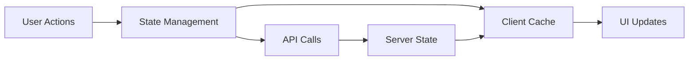
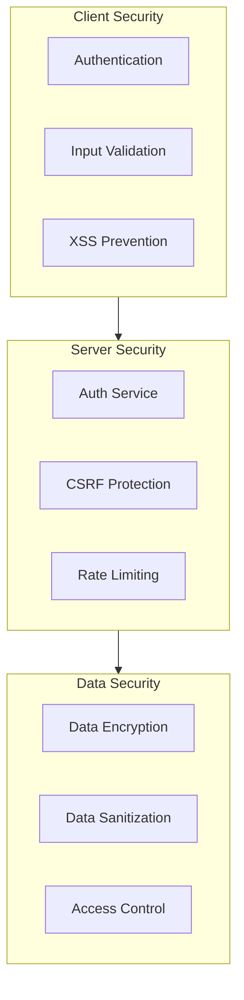
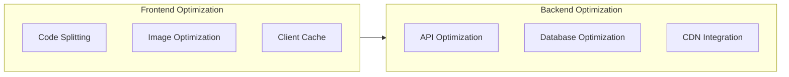
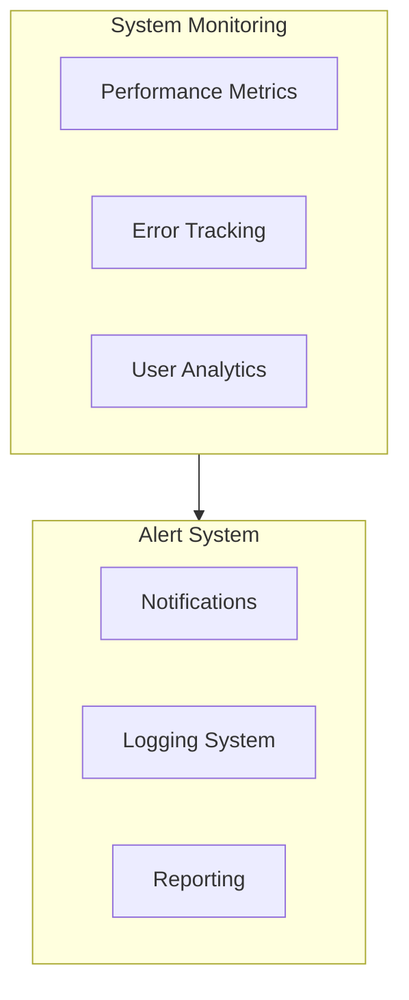

# High-Level Design (HLD) Diagram - The Student Voice

## System Architecture Overview



## Component Architecture



## Data Flow Architecture



## Technical Stack

### Frontend
- **Framework**: Next.js 14
- **Language**: TypeScript
- **Styling**: Tailwind CSS
- **UI Components**: Shadcn/ui
- **State Management**: React Context + Custom Hooks
- **Animations**: Framer Motion
- **Forms**: React Hook Form
- **Validation**: Zod
- **Icons**: Lucide React

### Backend
- **API**: Next.js API Routes
- **Database**: PostgreSQL
- **ORM**: Prisma
- **Authentication**: NextAuth.js
- **File Storage**: AWS S3
- **Email Service**: SendGrid
- **Analytics**: Google Analytics

### Development Tools
- **Version Control**: Git
- **Package Manager**: npm
- **Code Quality**: ESLint + Prettier
- **Testing**: Jest + React Testing Library
- **CI/CD**: GitHub Actions
- **Deployment**: Vercel

## Key Features and Considerations

### 1. User Experience (UX)
- Responsive design with mobile-first approach
- Consistent theming and styling
- Accessibility compliance (WCAG 2.1)
- Interactive components with smooth animations
- Progressive loading and skeleton states

### 2. Performance
- Image optimization with Next.js Image
- Code splitting and lazy loading
- Static and dynamic rendering strategies
- Resource caching and optimization
- Performance monitoring with Core Web Vitals

### 3. Security
- JWT-based authentication
- CSRF protection
- XSS prevention
- Secure data transmission (HTTPS)
- Input validation and sanitization

### 4. State Management
- Local state with React hooks
- Global state with Context API
- Server state with React Query
- Form state with React Hook Form
- Cache management with SWR

### 5. Testing Strategy
- Unit tests for components
- Integration tests for features
- E2E tests for critical flows
- Accessibility testing
- Performance testing

### 6. Deployment Strategy
- Continuous deployment with GitHub Actions
- Staging and production environments
- Automated testing and validation
- Rollback capabilities
- Monitoring and logging

### 7. SEO Optimization
- Meta tags and descriptions
- Semantic HTML structure
- Sitemap generation
- Robots.txt configuration
- Open Graph tags

### 8. Internationalization
- Multi-language support
- RTL layout support
- Date and number formatting
- Currency handling
- Translation management

## Directory Structure

```
├── app/                    # Next.js 14 app directory
│   ├── (auth)/            # Authentication routes
│   ├── (dashboard)/       # Protected dashboard routes
│   ├── mental-health/     # Mental health module
│   ├── career/           # Career module
│   ├── community/        # Community module
│   ├── counseling/       # Counseling module
│   └── api/              # API routes
├── components/           # Reusable components
│   ├── ui/              # UI components
│   ├── mental-health/   # Mental health components
│   ├── career/         # Career components
│   ├── community/      # Community components
│   └── counseling/     # Counseling components
├── lib/                 # Utilities and helpers
├── hooks/              # Custom React hooks
├── types/              # TypeScript types
├── styles/             # Global styles
├── public/             # Static assets
└── tests/              # Test files
```

## Component Hierarchy



## State Management Flow



## Security Architecture



## Performance Optimization



## Monitoring and Analytics

