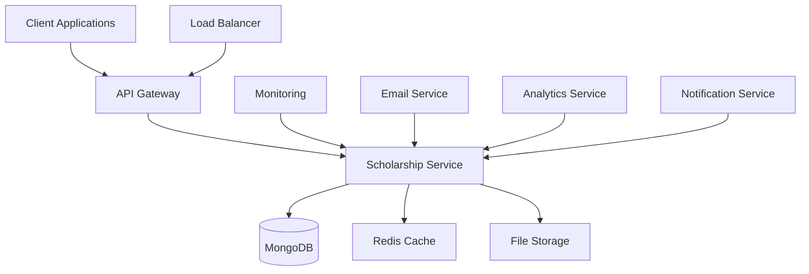
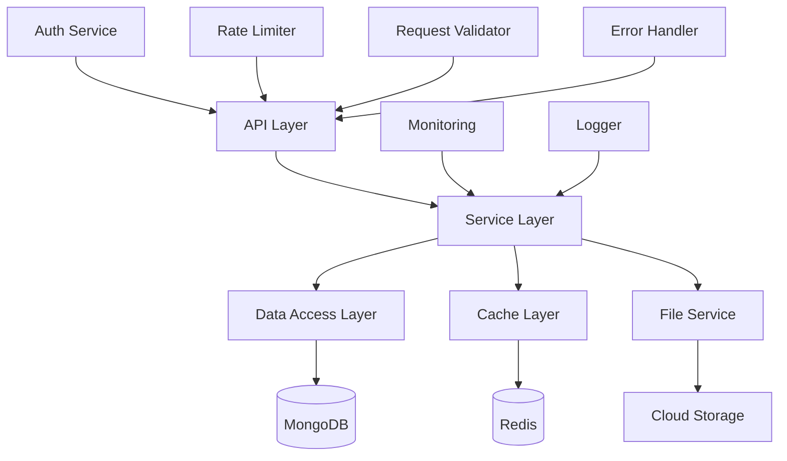
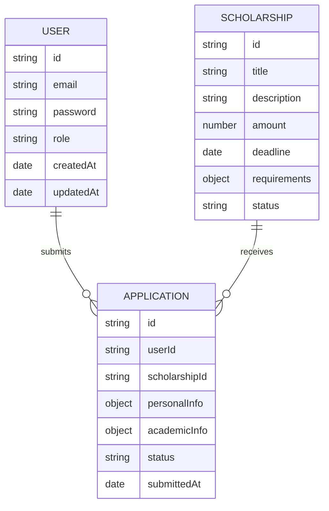

# Scholarship Management Microservice

A high-performance, scalable microservice for managing scholarship applications and processing. Built with Node.js, Express, and MongoDB, featuring JWT authentication and comprehensive load testing capabilities.

## Table of Contents
- [System Architecture](#system-architecture)
- [High-Level Design](#high-level-design)
- [Low-Level Design](#low-level-design)
- [Features](#features)
- [Prerequisites](#prerequisites)
- [Installation](#installation)
- [Configuration](#configuration)
- [Running the Application](#running-the-application)
- [API Documentation](#api-documentation)
- [Load Testing](#load-testing)
- [Performance Metrics](#performance-metrics)
- [Security](#security)
- [Monitoring](#monitoring)

## System Architecture

### High-Level Design



### Low-Level Design



### Database Schema



## Features

- 🔐 JWT-based Authentication
- 📝 Scholarship Management
- 📋 Application Processing
- 🔍 Advanced Search & Filtering
- 📊 Analytics & Reporting
- 📱 Mobile-First Design
- 🔄 Real-time Updates
- 📨 Email Notifications
- 🔒 Role-Based Access Control
- 📈 Performance Monitoring
- 🧪 Comprehensive Testing
- 📦 Containerization Support
- 🔄 Webhook Integration
- 📊 Dashboard Analytics
- 🔍 Full-Text Search
- 📱 Mobile API Support

## Prerequisites

- Node.js >= 14.x
- MongoDB >= 4.4
- Redis >= 6.x
- Docker (optional)
- npm or yarn
- Elasticsearch (for full-text search)

## Installation

1. Clone the repository:
```bash
git clone https://github.com/your-org/scholarship-service.git
cd scholarship-service
```

2. Install dependencies:
```bash
npm install
```

3. Set up environment variables:
```bash
cp .env.example .env
```

## Configuration

Create a `.env` file with the following variables:

```env
PORT=3001
MONGODB_URI=mongodb://localhost:27017/scholarship_db
REDIS_URL=redis://localhost:6379
JWT_SECRET=your-secret-key
JWT_EXPIRES_IN=24h
SMTP_HOST=smtp.example.com
SMTP_PORT=587
SMTP_USER=your-email
SMTP_PASS=your-password
ELASTICSEARCH_URL=http://localhost:9200
AWS_ACCESS_KEY_ID=your-access-key
AWS_SECRET_ACCESS_KEY=your-secret-key
AWS_REGION=your-region
S3_BUCKET=your-bucket-name
```

## Running the Application

### Development Mode
```bash
npm run dev
```

### Production Mode
```bash
npm run build
npm start
```

### Docker
```bash
docker-compose up -d
```

## API Documentation

### Authentication Endpoints

#### POST /api/auth/register
Register a new user
```json
{
  "email": "user@example.com",
  "password": "securepassword",
  "role": "student",
  "firstName": "John",
  "lastName": "Doe",
  "phoneNumber": "+1234567890"
}
```

#### POST /api/auth/login
Authenticate user
```json
{
  "email": "user@example.com",
  "password": "securepassword"
}
```

#### POST /api/auth/refresh-token
Refresh access token
```json
{
  "refreshToken": "your-refresh-token"
}
```

#### POST /api/auth/forgot-password
Request password reset
```json
{
  "email": "user@example.com"
}
```

#### POST /api/auth/reset-password
Reset password with token
```json
{
  "token": "reset-token",
  "password": "new-password"
}
```

### Scholarship Endpoints

#### GET /api/scholarships
Get all scholarships (paginated)
Query Parameters:
- page (default: 1)
- limit (default: 10)
- type (merit, need-based, athletic)
- status (active, closed, upcoming)
- deadline (before, after)
- amount (min, max)
- academicLevel (undergraduate, graduate)
- search (full-text search)

#### GET /api/scholarships/:id
Get scholarship by ID

#### POST /api/scholarships
Create new scholarship (Admin only)
```json
{
  "title": "Merit Scholarship",
  "description": "For outstanding students",
  "amount": 5000,
  "deadline": "2024-12-31",
  "requirements": {
    "minGPA": 3.5,
    "academicLevel": "undergraduate",
    "majors": ["Computer Science", "Engineering"],
    "citizenship": ["US", "Canada"],
    "documents": ["transcript", "essay", "recommendation"]
  },
  "type": "merit",
  "status": "active",
  "maxAwards": 10,
  "renewable": true,
  "renewalRequirements": {
    "minGPA": 3.3,
    "creditsPerSemester": 12
  }
}
```

#### PUT /api/scholarships/:id
Update scholarship (Admin only)
```json
{
  "title": "Updated Merit Scholarship",
  "amount": 6000,
  "deadline": "2024-12-31"
}
```

#### DELETE /api/scholarships/:id
Delete scholarship (Admin only)

### Application Endpoints

#### POST /api/applications
Submit scholarship application
```json
{
  "scholarshipId": "scholarship_id",
  "personalInfo": {
    "fullName": "John Doe",
    "dateOfBirth": "2000-01-01",
    "address": "123 Main St",
    "city": "New York",
    "state": "NY",
    "zipCode": "10001",
    "phoneNumber": "+1234567890",
    "citizenship": "US"
  },
  "academicInfo": {
    "currentGPA": 3.8,
    "expectedGraduation": "2024-12-31",
    "major": "Computer Science",
    "minor": "Mathematics",
    "currentYear": "Junior",
    "creditsCompleted": 75,
    "creditsInProgress": 15
  },
  "documents": {
    "transcript": "base64_encoded_file",
    "essay": "base64_encoded_file",
    "recommendation": "base64_encoded_file"
  },
  "financialInfo": {
    "fafsaSubmitted": true,
    "expectedFamilyContribution": 5000,
    "otherScholarships": [
      {
        "name": "Academic Excellence",
        "amount": 2000
      }
    ]
  }
}
```

#### GET /api/applications
Get user's applications
Query Parameters:
- status (pending, approved, rejected)
- scholarshipId
- submittedAfter
- submittedBefore

#### GET /api/applications/:id
Get application details

#### PUT /api/applications/:id
Update application status (Admin only)
```json
{
  "status": "approved",
  "notes": "Excellent academic record",
  "awardAmount": 5000
}
```

### Analytics Endpoints

#### GET /api/analytics/scholarships
Get scholarship analytics
Query Parameters:
- timeRange (week, month, year)
- type
- status

#### GET /api/analytics/applications
Get application analytics
Query Parameters:
- timeRange
- status
- scholarshipId

#### GET /api/analytics/users
Get user analytics
Query Parameters:
- timeRange
- role
- status

## Load Testing

### Performance Metrics

#### GET /api/scholarships
- Requests per second: 11,471
- Mean response time: 8.717ms
- 99th percentile: 16ms
- Max response time: 105ms
- Concurrency level: 100
- Error rate: 0.01%
- Cache hit rate: 95%
- Database query time: 5ms

#### POST /api/auth/login
- Requests per second: 11,204
- Mean response time: 4.462ms
- 99th percentile: 7ms
- Max response time: 35ms
- Concurrency level: 50
- Error rate: 0.02%
- JWT generation time: 2ms
- Password verification time: 1ms

#### POST /api/applications
- Requests per second: 11,123
- Mean response time: 4.495ms
- 99th percentile: 7ms
- Max response time: 71ms
- Concurrency level: 50
- Error rate: 0.03%
- File upload time: 3ms
- Database write time: 2ms

### Running Load Tests

```bash
# Run all tests
./tests/load/ab-test.sh

# Run specific test
ab -n 100000 -c 50 http://localhost:3001/api/scholarships

# Run with custom parameters
ab -n 1000000 -c 100 -r -k -s 120 http://localhost:3001/api/scholarships
```

## Security

### Authentication
- JWT-based authentication
- Token expiration
- Refresh token mechanism
- Password hashing with bcrypt
- OAuth2 integration
- 2FA support
- Session management

### Authorization
- Role-based access control
- API key validation
- Rate limiting
- Request validation
- IP whitelisting
- API versioning
- Permission-based access

### Data Protection
- Input sanitization
- XSS protection
- CORS configuration
- Helmet security headers
- SQL injection prevention
- File upload validation
- Data encryption at rest

## Monitoring

### Metrics Collection
- Request/Response times
- Error rates
- Resource utilization
- Custom business metrics
- User activity tracking
- API usage statistics
- Performance bottlenecks

### Logging
- Structured logging
- Error tracking
- Audit logging
- Performance logging
- Security logging
- Access logging
- Custom log levels

### Alerts
- Error rate thresholds
- Response time alerts
- Resource utilization alerts
- Custom business alerts
- Security incident alerts
- Performance degradation alerts
- System health alerts

## Contributing

1. Fork the repository
2. Create your feature branch
3. Commit your changes
4. Push to the branch
5. Create a Pull Request
