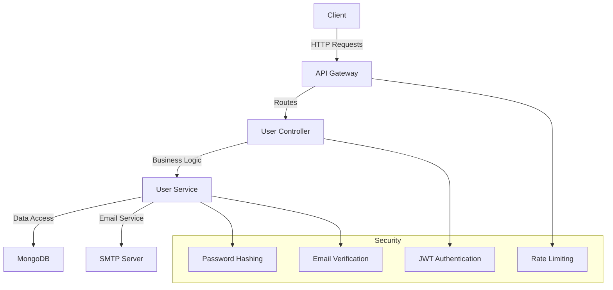

# User Management Service

A robust and secure user management service built with Node.js, Express, and MongoDB. This service handles user authentication, authorization, and profile management with email verification and security features.

## Architecture



## Features

- 🔐 Secure Authentication with JWT
- ✉️ Email Verification System
- 🔒 Password Hashing and Security
- 👥 Role-Based Access Control
- 📧 Email Notifications
- 🔄 Password Reset Flow
- 🛡️ Rate Limiting
- 📝 User Profile Management
- 🔍 User Search and Filtering
- 🚫 Account Locking

## Prerequisites

- Node.js (v14 or higher)
- MongoDB (v4.4 or higher)
- SMTP Server (for email notifications)
- npm or yarn package manager

## Installation

1. Clone the repository:
```bash
git clone <repository-url>
cd user-management
```

2. Install dependencies:
```bash
npm install
```

3. Create a `.env` file in the root directory:
```env
PORT=3000
MONGODB_URI=mongodb://localhost:27017/tsv_db
JWT_SECRET=your_jwt_secret
EMAIL_USER=your_email@example.com
EMAIL_PASSWORD=your_email_password
```

4. Start the service:
```bash
npm start
```

## API Documentation

### Authentication Endpoints

#### Register User
```http
POST /api/users/register
Content-Type: application/json

{
    "firstName": "John",
    "lastName": "Doe",
    "email": "john@example.com",
    "password": "securePassword123",
    "role": "user"
}
```

#### Login
```http
POST /api/users/login
Content-Type: application/json

{
    "email": "john@example.com",
    "password": "securePassword123"
}
```

#### Verify Email
```http
GET /api/users/verify/:token
```

#### Forgot Password
```http
POST /api/users/forgot-password
Content-Type: application/json

{
    "email": "john@example.com"
}
```

#### Reset Password
```http
POST /api/users/reset-password
Content-Type: application/json

{
    "token": "reset_token",
    "password": "newPassword123"
}
```

### User Management Endpoints

#### Get User Profile
```http
GET /api/users/profile
Authorization: Bearer <jwt_token>
```

#### Update User Profile
```http
PUT /api/users/profile
Authorization: Bearer <jwt_token>
Content-Type: application/json

{
    "firstName": "John",
    "lastName": "Doe",
    "phoneNumber": "+1234567890"
}
```

#### Change Password
```http
PUT /api/users/change-password
Authorization: Bearer <jwt_token>
Content-Type: application/json

{
    "currentPassword": "oldPassword123",
    "newPassword": "newPassword123"
}
```

### Admin Endpoints

#### Get All Users
```http
GET /api/admin/users
Authorization: Bearer <jwt_token>
```

#### Get User by ID
```http
GET /api/admin/users/:id
Authorization: Bearer <jwt_token>
```

#### Update User Role
```http
PUT /api/admin/users/:id/role
Authorization: Bearer <jwt_token>
Content-Type: application/json

{
    "role": "admin"
}
```

#### Delete User
```http
DELETE /api/admin/users/:id
Authorization: Bearer <jwt_token>
```

## Security Features

### Password Security
- Passwords are hashed using bcrypt
- Minimum password length requirement
- Password complexity requirements
- Secure password reset flow

### Authentication
- JWT-based authentication
- Token expiration
- Refresh token mechanism
- Rate limiting on authentication endpoints

### Email Verification
- Secure verification tokens
- Token expiration
- Resend verification email option
- Masked user data until verification

### Account Protection
- Account locking after failed attempts
- Session management
- IP-based rate limiting
- Secure headers

## Data Models

### User Schema
```javascript
{
    firstName: String,
    lastName: String,
    email: String,
    password: String,
    role: String,
    isEmailVerified: Boolean,
    isPendingVerification: Boolean,
    maskedEmail: String,
    maskedFirstName: String,
    maskedLastName: String,
    verificationToken: String,
    verificationTokenExpires: Date,
    resetPasswordToken: String,
    resetPasswordExpires: Date,
    failedLoginAttempts: Number,
    isLocked: Boolean,
    lockUntil: Date,
    createdAt: Date,
    updatedAt: Date
}
```

## Error Handling

The service implements comprehensive error handling:

- Validation errors (400)
- Authentication errors (401)
- Authorization errors (403)
- Not found errors (404)
- Rate limit errors (429)
- Server errors (500)

## Logging

The service uses Winston for logging with the following levels:
- Error: Critical errors
- Warn: Warning messages
- Info: General information
- Debug: Detailed debugging information

Logs are stored in the `logs` directory with separate files for:
- User service logs
- Error logs
- Combined logs

## Testing

Run the test suite:
```bash
npm test
```

## Deployment

1. Set up environment variables
2. Configure MongoDB connection
3. Set up email service
4. Configure rate limiting
5. Set up monitoring
6. Deploy to production server

## Best Practices

- Input validation
- Error handling
- Security headers
- Rate limiting
- Logging
- Monitoring
- Code organization
- Documentation

## Contributing

1. Fork the repository
2. Create a feature branch
3. Commit your changes
4. Push to the branch
5. Create a Pull Request

## Support

For support, please contact the development team or create an issue in the repository.
