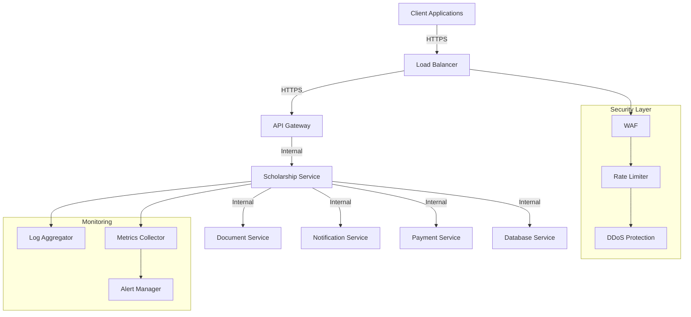
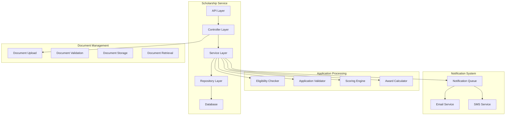
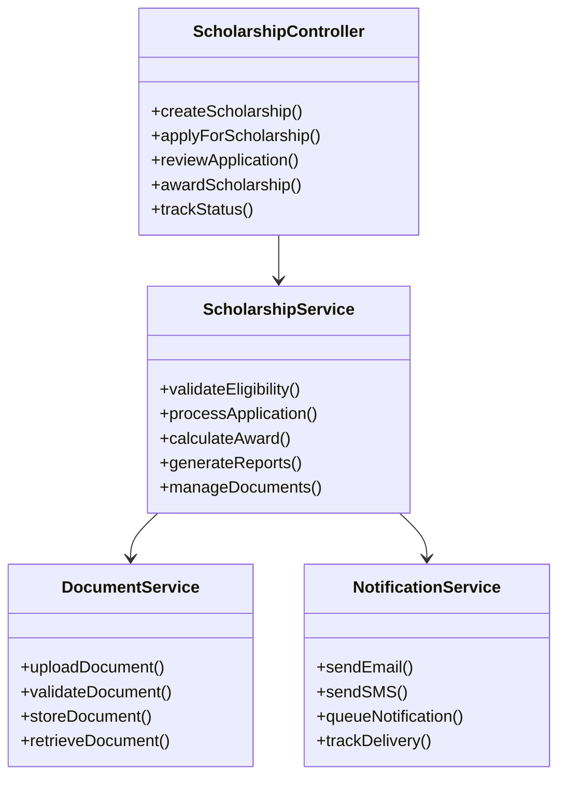
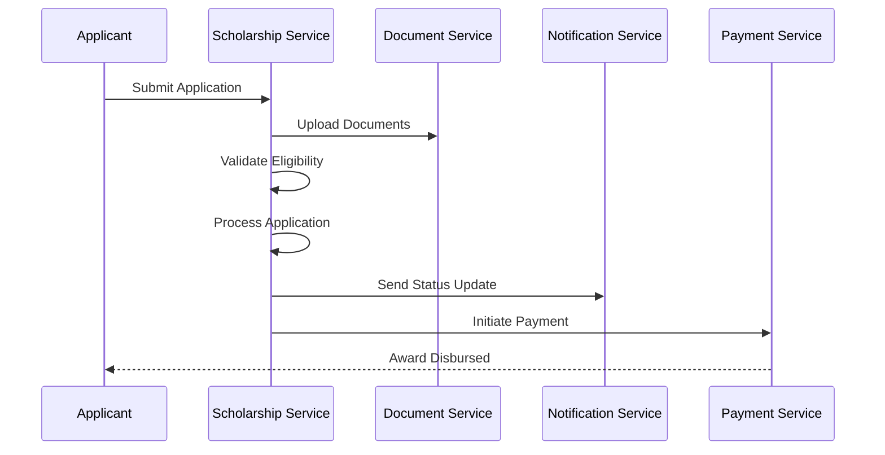
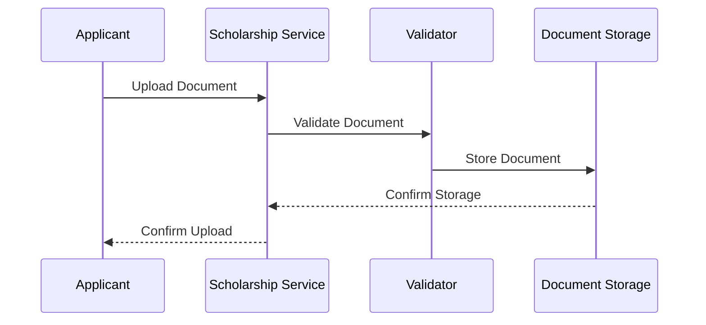
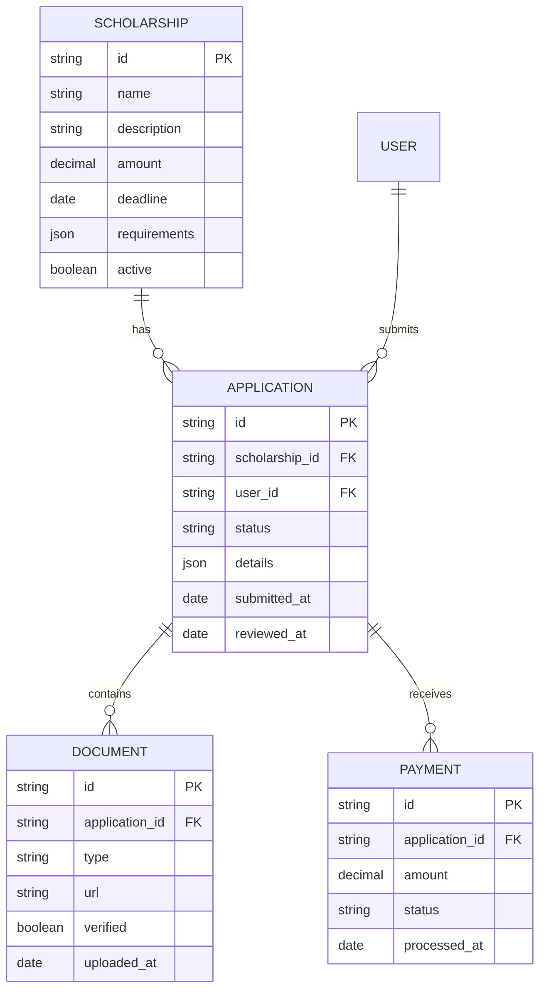

# Scholarship Management Service

A comprehensive scholarship management system built with Node.js, Express, and MongoDB. This service handles scholarship applications, eligibility checks, document management, and award distribution with advanced features for both applicants and administrators.

## Architecture Overview

### High-Level Architecture


### Detailed Component Architecture


## Architecture Details

### High-Level Design (HLD)

#### 1. System Components
- **Client Applications**: Web portal and mobile applications
- **Load Balancer**: Distributes traffic across multiple service instances
- **API Gateway**: Routes requests and handles cross-cutting concerns
- **Scholarship Service**: Core scholarship management functionality
- **Document Service**: Handles document upload and management
- **Notification Service**: Manages communications
- **Payment Service**: Handles scholarship disbursements
- **Database Service**: Data persistence layer

#### 2. Security Architecture
- **Web Application Firewall (WAF)**: Protects against web-based attacks
- **Rate Limiter**: Prevents abuse and ensures fair usage
- **DDoS Protection**: Mitigates distributed denial of service attacks
- **JWT Authentication**: Stateless authentication mechanism
- **Document Encryption**: Secure document storage
- **Input Validation**: Prevents injection attacks

#### 3. Monitoring Architecture
- **Log Aggregator**: Centralizes logs from all components
- **Metrics Collector**: Gathers system performance metrics
- **Alert Manager**: Manages system alerts and notifications

### Low-Level Design (LLD)

#### 1. Scholarship Service Components


#### 2. Application Flow


#### 3. Document Management Flow


#### 4. Database Schema


#### 5. Error Handling Strategy
- **Validation Errors**: 400 Bad Request
- **Authentication Errors**: 401 Unauthorized
- **Authorization Errors**: 403 Forbidden
- **Not Found Errors**: 404 Not Found
- **Document Errors**: 422 Unprocessable Entity
- **Rate Limit Errors**: 429 Too Many Requests
- **Server Errors**: 500 Internal Server Error

#### 6. Logging Strategy
- **Application Logs**: Winston logger
- **Document Logs**: Document processing events
- **Payment Logs**: Transaction records
- **Audit Logs**: Application review events

## Features

- 📝 Scholarship Application Management
- 📄 Document Upload and Validation
- ✅ Eligibility Checking
- 💰 Award Calculation and Distribution
- 📧 Automated Notifications
- 📊 Reporting and Analytics
- 🔒 Secure Document Storage
- 👥 Multi-role Access Control
- 📱 Mobile-friendly Interface
- 📈 Application Tracking

## Prerequisites

- Node.js (v14 or higher)
- MongoDB (v4.4 or higher)
- Redis (for caching)
- AWS S3 (for document storage)
- SMTP Server (for notifications)
- npm or yarn package manager

## Installation

1. Clone the repository:
```bash
git clone <repository-url>
cd scholarship
```

2. Install dependencies:
```bash
npm install
```

3. Create a `.env` file in the root directory:
```env
PORT=3000
MONGODB_URI=mongodb://localhost:27017/scholarship_db
JWT_SECRET=your_jwt_secret
AWS_ACCESS_KEY=your_aws_access_key
AWS_SECRET_KEY=your_aws_secret_key
AWS_BUCKET=your_bucket_name
EMAIL_USER=your_email@example.com
EMAIL_PASSWORD=your_email_password
```

4. Start the service:
```bash
npm start
```

## API Documentation

### Scholarship Management

#### Create Scholarship
```http
POST /api/scholarships
Authorization: Bearer <jwt_token>
Content-Type: application/json

{
    "name": "Academic Excellence Scholarship",
    "description": "Award for outstanding academic performance",
    "amount": 5000,
    "deadline": "2024-12-31",
    "requirements": {
        "minGPA": 3.5,
        "documents": ["transcript", "recommendation"]
    }
}
```

#### Apply for Scholarship
```http
POST /api/scholarships/:id/applications
Authorization: Bearer <jwt_token>
Content-Type: multipart/form-data

{
    "personalInfo": {
        "firstName": "John",
        "lastName": "Doe",
        "email": "john@example.com"
    },
    "academicInfo": {
        "gpa": 3.8,
        "major": "Computer Science"
    },
    "documents": {
        "transcript": <file>,
        "recommendation": <file>
    }
}
```

#### Review Application
```http
PUT /api/applications/:id/review
Authorization: Bearer <jwt_token>
Content-Type: application/json

{
    "status": "approved",
    "comments": "Excellent academic record",
    "awardAmount": 5000
}
```

### Document Management

#### Upload Document
```http
POST /api/applications/:id/documents
Authorization: Bearer <jwt_token>
Content-Type: multipart/form-data

{
    "type": "transcript",
    "file": <file>
}
```

#### Validate Document
```http
POST /api/documents/:id/validate
Authorization: Bearer <jwt_token>
```

### Payment Management

#### Initiate Payment
```http
POST /api/applications/:id/payments
Authorization: Bearer <jwt_token>
Content-Type: application/json

{
    "amount": 5000,
    "method": "bank_transfer"
}
```

## Security Features

### Document Security
- Encrypted storage
- Access control
- Version tracking
- Audit logging

### Application Security
- Input validation
- Rate limiting
- IP blocking
- Session management

### Payment Security
- Secure transactions
- Payment verification
- Fraud detection
- Audit trails

## Data Models

### Scholarship Schema
```javascript
{
    name: String,
    description: String,
    amount: Number,
    deadline: Date,
    requirements: {
        minGPA: Number,
        documents: [String],
        eligibility: Object
    },
    status: String,
    createdAt: Date,
    updatedAt: Date
}
```

### Application Schema
```javascript
{
    scholarshipId: ObjectId,
    userId: ObjectId,
    personalInfo: {
        firstName: String,
        lastName: String,
        email: String,
        phone: String
    },
    academicInfo: {
        gpa: Number,
        major: String,
        institution: String
    },
    documents: [{
        type: String,
        url: String,
        verified: Boolean
    }],
    status: String,
    awardAmount: Number,
    submittedAt: Date,
    reviewedAt: Date
}
```

## Error Handling

The service implements comprehensive error handling:

- Validation errors (400)
- Authentication errors (401)
- Authorization errors (403)
- Not found errors (404)
- Document errors (422)
- Rate limit errors (429)
- Server errors (500)

## Logging

The service uses Winston for logging with the following levels:
- Error: Critical errors
- Warn: Warning messages
- Info: General information
- Debug: Detailed debugging information

Logs are stored in the `logs` directory with separate files for:
- Scholarship service logs
- Document service logs
- Payment service logs
- Error logs

## Testing

Run the test suite:
```bash
npm test
```

## Deployment

1. Set up environment variables
2. Configure MongoDB connection
3. Set up AWS S3 for document storage
4. Configure email service
5. Set up payment gateway
6. Configure monitoring
7. Deploy to production server

## Best Practices

- Input validation
- Error handling
- Security headers
- Rate limiting
- Logging
- Monitoring
- Code organization
- Documentation
- Testing
- CI/CD

## Contributing

1. Fork the repository
2. Create a feature branch
3. Commit your changes
4. Push to the branch
5. Create a Pull Request

## Support

For support, please contact the development team or create an issue in the repository.
